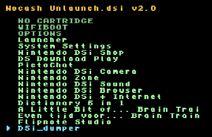
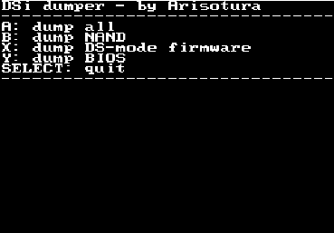

# Blowfish Extractor
A Python script to extract _blowfish keys_ from a DS or DSi BIOS dump.

More information about the blowfish keys can be found in [GBATek](https://problemkaputt.de/gbatek.htm#dsencryptionbygamecodeidcodekey1).

## Installation

Start by cloning this repository using Git:
```shell
git clone https://github.com/xbmbmx/py-nds-blowfish-extractor.git
```

Enter the directory for this project:
```shell
cd py-nds-blowfish-extractor
```

**(optional, but recommended)** I recommend creating a virtual environment for Python based tools like this one. This command will create a virtual environment named `venv` in the project folder:
```shell
python -m venv venv
```

**(optional, but recommended)** Activate this virtual environment (command may vary depending on the shell used, assuming bash here):

```
source venv/Scripts/activate
```

Install the required dependencies using pip:
```shell
pip install -r requirements.txt
```

The tool and its dependencies are now installed. Continue reading for usage information.

## Usage

If you installed this program using a virtual environment, make sure it is activated before running the tool.

Get help and usage information by running:
```shell
python ./extractor.py --help
```
For the current version of `extractor.py`, this should output:

```txt
usage: extractor.py [-h] -s STARTADDRESS -b BIOSFILE [-o OUTFILE] [-f]

Extract blowfish keys from dumped DS/DSi BIOS files

options:
  -h, --help            show this help message and exit
  -s STARTADDRESS, --startaddress STARTADDRESS
                        The address to start reading from, in HEX (0xFF) or INT (255)
  -b BIOSFILE, --biosfile BIOSFILE
                        The BIOS file to read the keys from
  -o OUTFILE, --outfile OUTFILE
                        The file to output the extracted keys to
  -f, --force           Overwrite the output file if already present
```

An example of a command to extract blowfish keys from the DS bios file `./bios7.bin` to the output file `./blowfish-keys.bin`, starting from address `0x30` looks like this:

```shell
python ./extractor.py -s 0x30 -b ./bios7.bin -o ./blowfish-keys.bin -f
```

Continue reading if you do not yet have a bios dump to extract these keys from.

## Obtaining a BIOS dump
You should always dump the BIOS from _your personally owned_ device. I do not promote the sharing of these files.

The easiest method to extract a BIOS dump from your DSi console is using [dsibiosdumper (download)](https://melonds.kuribo64.net/downloads/dsibiosdumper.7z) | [dsibiosdumper (source)](https://github.com/Arisotura/dsibiosdumper).

Launch `dsibiosdumper.nds` through Unlaunch. Unlaunch lists this file as `DSi_dumper`.



Once launched, you should be greeted by the main screen for `dsibiosdumper.nds`.



Press the `A` button to dump all contents. The `dsidump` folder on the root of your SD card should now contain the following 5 files:

```
- bios7.bin
- bios7i.bin
- bios9.bin
- bios9i.bin
- dsfirmware.bin
- nand.bin
```

The files prefixed with `bios` can be used to extract blowfish keys. Locations of blowfish keys in each of the files can be found in [GBATek](https://problemkaputt.de/gbatek.htm#dsencryptionbygamecodeidcodekey1). The `-s`/`--startaddress` parameter should be set accordingly when executing `extractor.py`